# Used Cars Database

A database design project for used cars e-commerce.

## Background

On this used car website, users who register as sellers can create advertisements offering used cars for sale. On the other hand, users who register as buyers can search for products based on several categories.

## Feature & Constraints

1. Each seller can list one or more used car products for sale.
2. Before selling a car, the seller must complete their personal data, including name, contact information, and domicile location.
3. Sellers offer their products through advertisements that will be displayed on the website.
4. The ads on the website include titles, detailed product information, and contact details of the sellers.
5. Some of the information that must be included in the ad are as follows:
     - Brand
     - Model
     - Body type
     - Car type
     - Production year
     - Additional descriptions such as color or mileage may be added as needed.
6. Each buyer can search for the offered cars based on the seller's location, brand, and car body type.
7. If a potential buyer is interested, they can submit a bid (if the seller allows the bidding feature).

## Designing the Database

### 1. Mission Statement

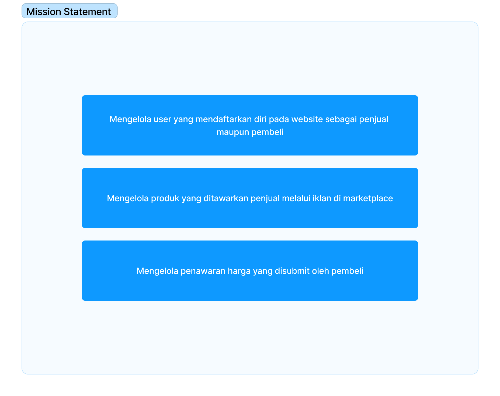

### 2. Creating Table Structures

- Determine the objects

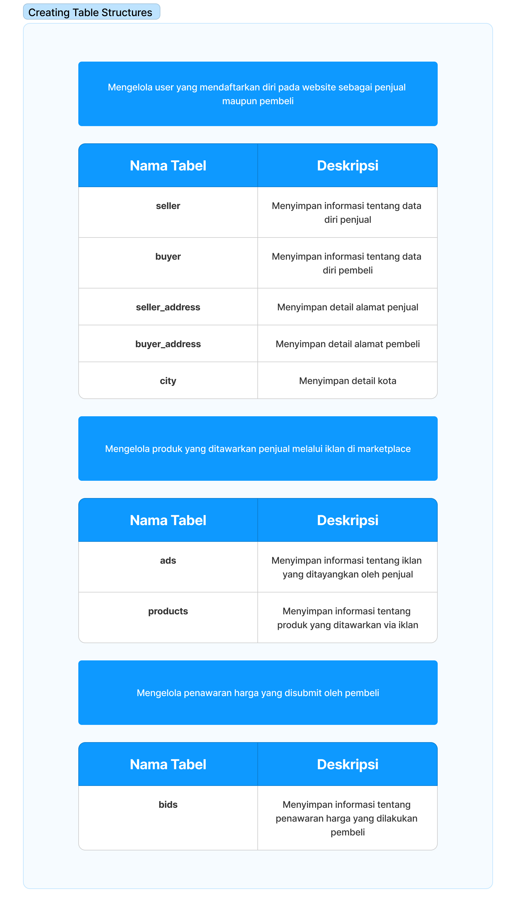

- Creating Field Name and Data Type

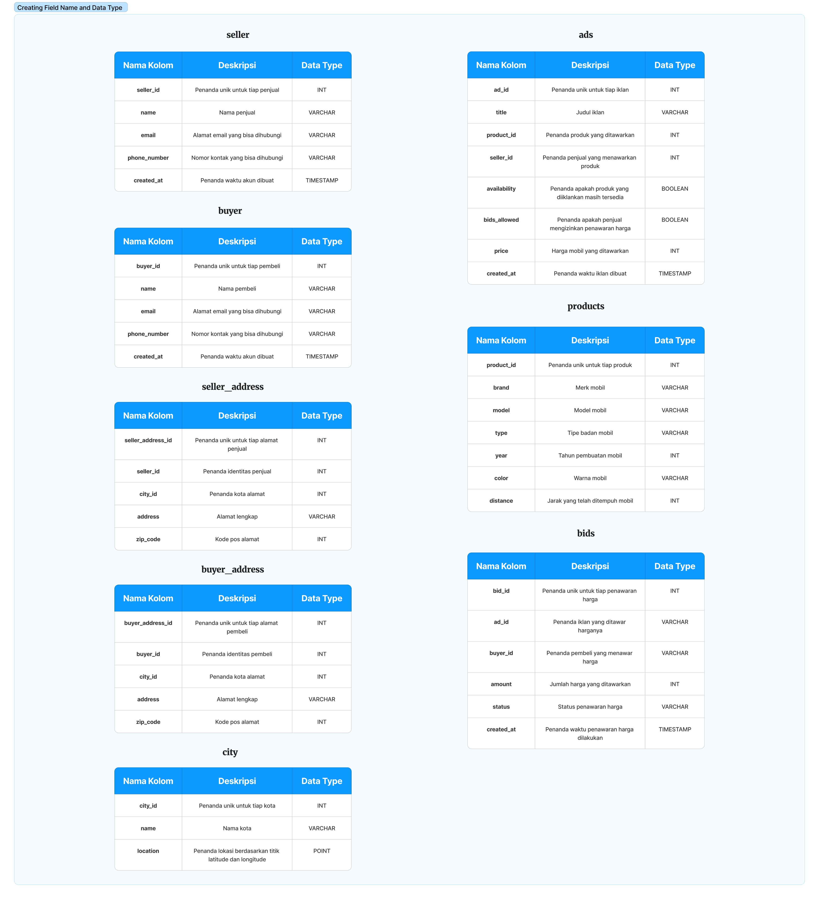

- Determine Candidate Keys

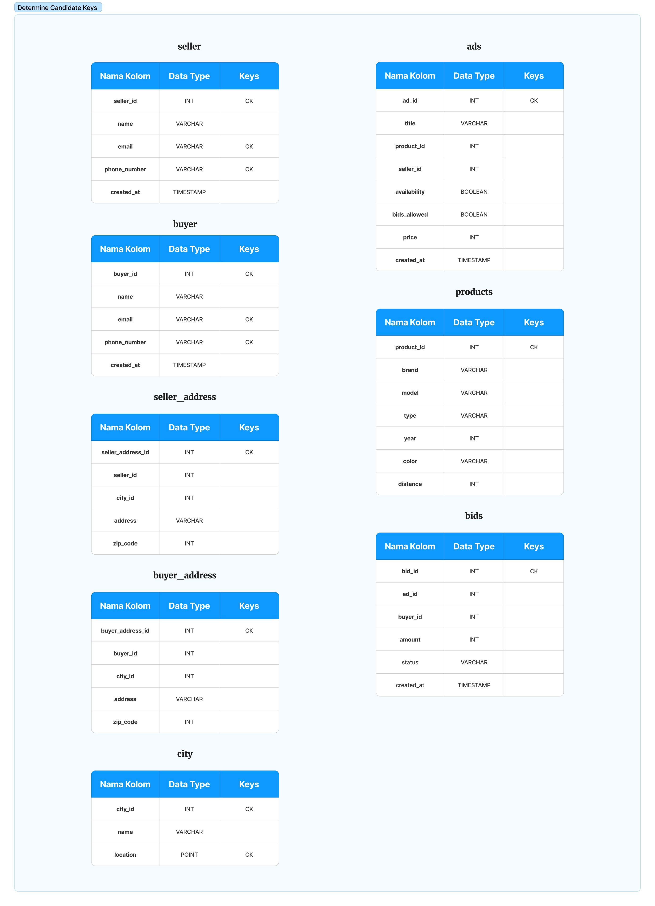

- Determine Primary Keys

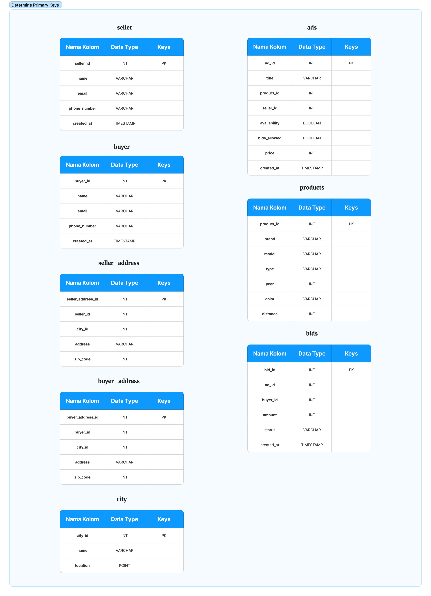

### 3. Determine Table Relationships

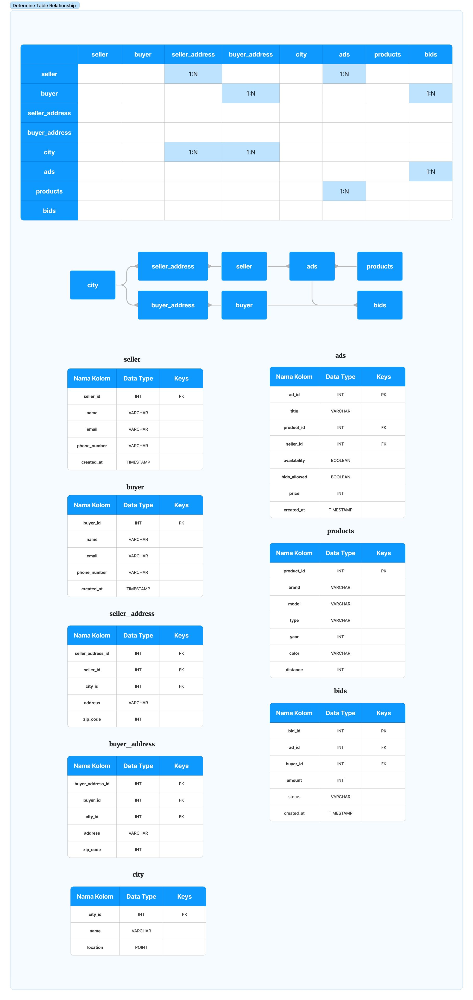

### 4. Determine Business Rule

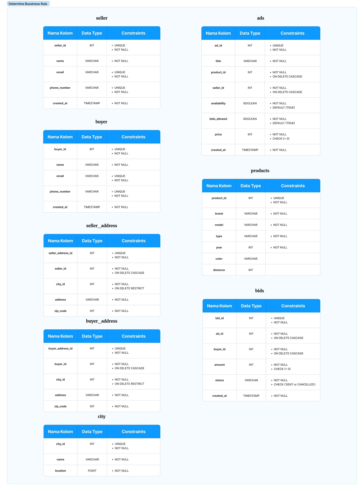

### 5. Entity Relationship Diagram

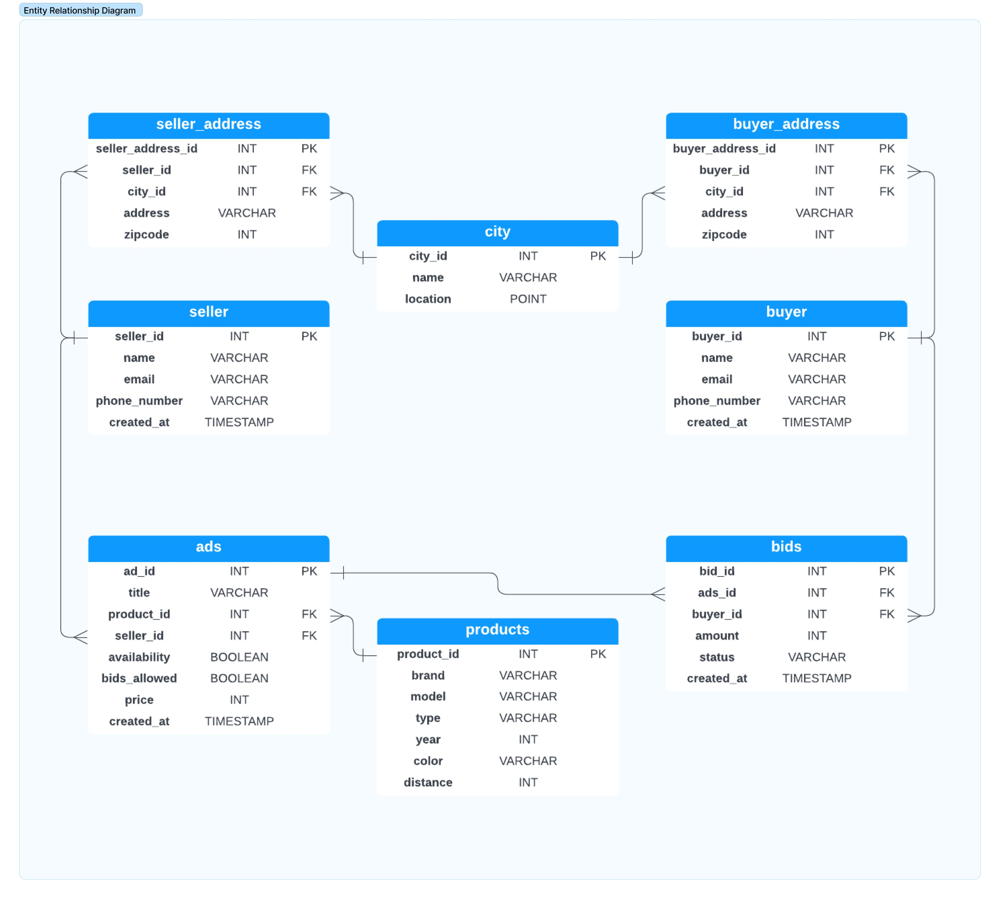

## Implementing the Design

Tables are created in the PostgreSQL database using the following Data Definition Language (DDL) syntax:

```sql
    -- TABLE 1 - seller
    CREATE TABLE seller(
        seller_id SERIAL PRIMARY KEY,
        name VARCHAR(255) NOT NULL,
        email VARCHAR(50) UNIQUE NOT NULL,
        phone_number VARCHAR(20) UNIQUE NOT NULL,
        created_at TIMESTAMP NOT NULL
    );

    -- TABLE 2 - buyer
    CREATE TABLE buyer(
        buyer_id SERIAL PRIMARY KEY,
        name VARCHAR(255) NOT NULL,
        email VARCHAR(50) UNIQUE NOT NULL,
        phone_number VARCHAR(20) UNIQUE NOT NULL,
        created_at TIMESTAMP NOT NULL
    );

    -- TABLE 3 - city
    CREATE TABLE city(
        city_id SERIAL PRIMARY KEY,
        name VARCHAR(255) NOT NULL,
        location POINT NOT NULL
    );

    -- TABLE 4 - seller_address
    CREATE TABLE seller_address(
        seller_address_id SERIAL PRIMARY KEY,
        seller_id INT NOT NULL
            REFERENCES seller(seller_id) ON DELETE CASCADE,
        city_id INT NOT NULL 
            REFERENCES city(city_id) ON DELETE RESTRICT,
        address VARCHAR(255) NOT NULL,
        zip_code INT NOT NULL
    );

    -- TABLE 5 - buyer_address
    CREATE TABLE buyer_address(
        buyer_address_id SERIAL PRIMARY KEY,
        buyer_id INT NOT NULL
            REFERENCES buyer(buyer_id) ON DELETE CASCADE,
        city_id INT NOT NULL 
            REFERENCES city(city_id) ON DELETE RESTRICT,
        address VARCHAR(255) NOT NULL,
        zip_code INT NOT NULL
    );

    -- TABLE 6 - products
    CREATE TABLE products(
        product_id SERIAL PRIMARY KEY,
        brand VARCHAR(50) NOT NULL,
        model VARCHAR(50) NOT NULL,
        type VARCHAR(50) NOT NULL,
        year INT NOT NULL,
        color VARCHAR(50),
        distance INT
    );

    -- TABLE 7 - ads
    CREATE TABLE ads(
        ad_id SERIAL PRIMARY KEY,
        title VARCHAR(255) NOT NULL,
        product_id INT NOT NULL 
            REFERENCES products(product_id) ON DELETE CASCADE,
        seller_id INT NOT NULL
            REFERENCES seller(seller_id) ON DELETE CASCADE,
        availability BOOL NOT NULL DEFAULT true,
        bids_allowed BOOL NOT NULL DEFAULT true,
        price INT NOT NULL CHECK(price > 0),
        created_at TIMESTAMP NOT NULL
    );

    -- TABLE 8 - bids
    CREATE TABLE bids(
        bid_id SERIAL PRIMARY KEY,
        ad_id INT NOT NULL
            REFERENCES seller(seller_id) ON DELETE CASCADE,
        buyer_id INT NOT NULL
            REFERENCES buyer(buyer_id) ON DELETE CASCADE,
        amount INT NOT NULL CHECK(amount > 0),
        status VARCHAR(20) CHECK(status IN ('Sent', 'Cancelled')),
        created_at TIMESTAMP NOT NULL
    );
```

## Populating the Database

This database utilizes a dummy dataset to populate the data in each table. The dummy dataset is obtained from Excel files or generated using the `Faker` library. All the dummy data is then converted to a CSV file and imported into the PostgreSQL database using the import tool pgAdmin 4.

### read_excel

The `read_excel` module functions to retrieve data from an Excel file with the help of the `openpyxl` library and then converts it into a list of dictionaries, which can be further processed.

```py
import openpyxl

def read_excel(file_name: str, worksheet_name: str):
    workbook = openpyxl.load_workbook(file_name)
    worksheet = workbook[worksheet_name]

    data = []
    headers = []

    for item in range(1, worksheet.max_column + 1):
        headers.append(worksheet.cell(row=1, column=item).value)

    for row in worksheet.iter_rows(min_row=2, values_only=True):
        row_data = {}

        for item in range(len(headers)):
            key = headers[item]
            value = row[item]

            row_data[key] = value

        data.append(row_data)

    return data
```

### show_data

The `show_data` module functions to display generated data tables. The views are created with the help of the `tabulate` library.

```py
from tabulate import tabulate

def show_data(table: dict):
    tab = tabulate(tabular_data=table,
                    headers=table.keys(),
                    tablefmt="psql",
                    numalign="center")
    print(tab)
```

### get_tables.py

The `get_tables` module reads Excel file data using the `read_excel` module and then returns a dictionary which can be displayed using the `show_data` module. The available Excel files are:

- city
- car_product

The two datasets will be processed by the `get_city_table()` and `get_product_table()` functions and then return the `city` and `product` dictionaries. Specifically for `product`, a new column is also added which is not yet available in the Excel file and then the data is generated with `Faker`.

```py
from read_excel import read_excel
from show_data import show_data
from faker import Faker

FAKER = Faker('id_ID')

def get_city_table(file_name: str, worksheet_name: str, is_print: bool):
    city_id = []
    name = []
    location = []

    data = read_excel(file_name, worksheet_name)
    
    city = {}
    city["city_id"] = [int(data[i]["kota_id"]) for i in range(len(data))]
    city["name"] = [data[i]["nama_kota"] for i in range(len(data))]
    city["location"] = [f'{data[i]["longitude"]}, {data[i]["latitude"]}' for i in range(len(data))]

    if is_print:
        show_data(city)
    
    return city

def get_product_table(file_name: str, worksheet_name: str, is_print: bool):
    data = read_excel(file_name, worksheet_name)
    
    product = {}
    product["product_id"] = [int(data[i]['product_id']) for i in range(len(data))]
    product["brand"] = [data[i]['brand'] for i in range(len(data))]
    product["model"] = [data[i]['model'] for i in range(len(data))]
    product["type"] = [data[i]['body_type'] for i in range(len(data))]
    product["year"] = [int(data[i]['year']) for i in range(len(data))]
    
    product["color"] = [FAKER.color_name() for i in range(len(data))]
    product["distance"] = [FAKER.random_int(20_000, 100_000, 5_000) for i in range(len(data))]

    if is_print:
        show_data(product)
    
    return product
```

### create_tables.py

The `create_tables` module contains functions that return dictionary tables whose contents are generated using the `Faker`, `datetime`, (for date data), and `random` libraries.

The tables created inside `create_tables` are:

- seller
- buyers
- seller_address
- buyer_address
- ads
- bids

```py
from faker import Faker
from datetime import datetime
from show_data import show_data
import random

FAKER = Faker('id_ID')

def create_seller_table(n_seller: int, is_print: bool):
    seller = {}
    seller["seller_id"] = [i+1 for i in range(n_seller)]
    seller["name"] = [f"{FAKER.first_name()} {FAKER.last_name()}" for i in range(n_seller)]
    seller["email"] = [f"{name.lower().replace(' ', '')}@{FAKER.free_email_domain()}" for name in seller["name"]]
    seller["phone_number"] = [FAKER.phone_number() for i in range(n_seller)]
    seller["created_at"] = [FAKER.date_time_between( start_date=datetime(2022, 1, 1), end_date=datetime(2023, 4, 16) ) for i in range(n_seller)]

    if is_print:
        show_data(seller)
    
    return seller

def create_buyer_table(n_buyer: int, is_print: bool):
    buyer = {}
    buyer["buyer_id"] = [i+1 for i in range(n_buyer)]
    buyer["name"] = [f"{FAKER.first_name()} {FAKER.last_name()}" for i in range(n_buyer)]
    buyer["email"] = [f"{name.lower().replace(' ', '')}@{FAKER.free_email_domain()}" for name in buyer["name"]]
    buyer["phone_number"] = [FAKER.phone_number() for i in range(n_buyer)]
    buyer["created_at"] = [FAKER.date_time_between( start_date=datetime(2022, 1, 1), end_date=datetime(2023, 4, 16) ) for i in range(n_buyer)]

    if is_print:
        show_data(buyer)
    
    return buyer

def create_seller_address_table(seller: dict, city: dict, n_seller_address: int, is_print: bool):
    seller_address = {}
    seller_address["seller_address_id"] = [i+1 for i in range(n_seller_address)]
    seller_address["seller_id"] = [random.choice(seller["seller_id"]) for i in range(n_seller_address)]
    seller_address["city_id"] = [random.choice(city["city_id"]) for i in range(n_seller_address)]
    seller_address["address"] = [FAKER.address().split(",")[0] for i in range(n_seller_address)]
    seller_address["zip_code"] = [FAKER.postcode() for i in range(n_seller_address)]

    if is_print:
        show_data(seller_address)
    
    return seller_address

def create_buyer_address_table(buyer: dict, city: dict, n_buyer_address: int, is_print: bool):
    buyer_address = {}
    buyer_address["buyer_address_id"] = [i+1 for i in range(n_buyer_address)]
    buyer_address["buyer_id"] = [random.choice(buyer["buyer_id"]) for i in range(n_buyer_address)]
    buyer_address["city_id"] = [random.choice(city["city_id"]) for i in range(n_buyer_address)]
    buyer_address["address"] = [FAKER.address().split(",")[0] for i in range(n_buyer_address)]
    buyer_address["zip_code"] = [FAKER.postcode() for i in range(n_buyer_address)]

    if is_print:
        show_data(buyer_address)
    
    return buyer_address

def create_ads_table(product: dict, seller: dict, n_ads: int, is_print: bool):
    ads = {}
    ads["ad_id"] = [i+1 for i in range(n_ads)]
    ads["title"] = [FAKER.text() for i in range(n_ads)]
    ads["product_id"] = [random.choice(product["product_id"]) for i in range(n_ads)]
    ads["seller_id"] = [random.choice(seller["seller_id"]) for i in range(n_ads)]
    ads["availability"] = [random.choice([True, False]) for i in range(n_ads)]
    ads["bids_allowed"] = [random.choice([True, False]) for i in range(n_ads)]
    ads["price"] = [FAKER.random_int(100_000_000, 800_000_000, 10_000_000) for i in range(n_ads)]
    ads["created_at"] = [FAKER.date_time_between( start_date=datetime(2022, 1, 1), end_date=datetime(2023, 4, 16) ) for i in range(n_ads)]

    if is_print:
        show_data(ads)
    
    return ads

def create_bids_table(ads: dict, buyer: dict, n_bids: int, is_print: bool):
    bids = {}
    bids["bid_id"] = [i+1 for i in range(n_bids)]
    bids["ad_id"] = [random.choice(ads["ad_id"]) for i in range(n_bids)]
    bids["buyer_id"] = [random.choice(buyer["buyer_id"]) for i in range(n_bids)]
    bids["amount"] = [FAKER.random_int(100_000_000, 800_000_000, 10_000_000) for i in range(n_bids)]
    bids["status"] = ["".join(random.choices(["Sent", "Cancelled"], weights=(0.9, 0.1))) for i in range(n_bids)]
    bids["created_at"] = [FAKER.date_time_between( start_date=datetime(2022, 1, 1), end_date=datetime(2023, 4, 16) ) for i in range(n_bids)]

    if is_print:
        show_data(bids)
    
    return bids
```

### save_to_csv

The `save_to_csv` module accepts the generated dictionary and saves it to a CSV file using the `csv` library.

```py
import csv

def save_to_csv(data: dict, nama_file: str):
    with open(file=f"{nama_file}.csv", mode="w", newline="") as csv_file:
        writer = csv.writer(csv_file)

        writer.writerow(list(data.keys()))

        len_data = len(list(data.items())[0][1])

        for num in range(len_data):
            row = []
            for key in data.keys():
                row.append(data[key][num])
            writer.writerow(row)
```

The end result is 8 CSV files which will be imported into the tables in the PostgreSQL database.

## Database Backup

After all tables are filled in, a backup is created to facilitate the database restore process in case of unexpected events. The backup data is stored in the `backup.sql` file.

## Transactional Query

### 1. Looking for cars from 2015 and newer

Query:

```sql
SELECT
    ad_id,
    product_id, 
    brand, 
    model, 
    year, 
    price 
 FROM 
    ads
 INNER JOIN 
    products
    USING(product_id)
 WHERE 
    year >= 2015
 ORDER BY 
    year ASC,
    ad_id ASC
```

Output:
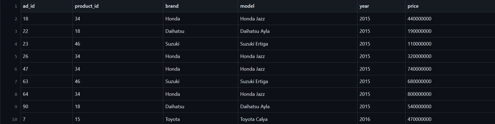

### 2. Added one new product bid record

Query:

```sql
INSERT INTO 
    bids(bid_id, ad_id, buyer_id, amount, status, created_at) 
    VALUES(21, 42, 7, 185500000, 'Sent', CURRENT_TIMESTAMP)
```

Output:


### 3. View all cars sold from a single account, sorted by most recent transactions

Query:

```sql
SELECT
  product_id, 
  brand, 
  model, 
  year, 
  price, 
  created_at 
 FROM 
  ads 
 INNER JOIN 
  products
  USING(product_id)
 WHERE 
  seller_id = 11
 ORDER BY 
  created_at DESC
```

Output:
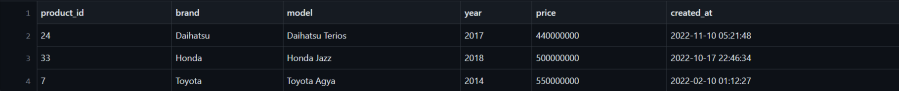

### 4. Search for the cheapest used cars based on keywords

Query:

```sql
SELECT
  ad_id,
  product_id,
  brand, 
  model, 
  year, 
  price
 FROM 
  ads 
 INNER JOIN 
  products
  USING(product_id)
 WHERE 
  model ILIKE '%Yaris%'
 ORDER BY 
  price ASC
```

Output:
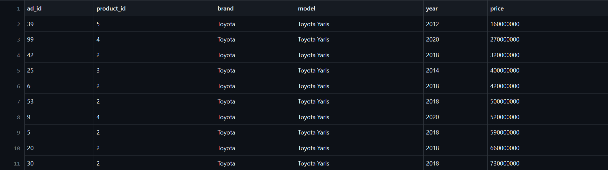

### 5. Find the nearest used car based on a city id

#### Distance calculations can be calculated using the euclidean distance formula based on latitude and longitude

Query:

```sql
    -- a. Membuat fungsi untuk menyimpan formula haversine
    CREATE FUNCTION haversine_distance(point_a POINT, point_b POINT)
    RETURNS float 
    LANGUAGE plpgsql
    
    AS 
    $$
    DECLARE
        lon_a float := radians(point_a[0]);
        lat_a float := radians(point_a[1]);
        lon_b float := radians(point_b[0]);
        lat_b float := radians(point_b[1]);
 
        d_lon float := lon_b - lon_a;
        d_lat float := lat_b - lat_a;
        a float;
        c float;
        r float := 6371;
        jarak float;
    BEGIN
        -- haversine formula
        a := sin(d_lat/2)^2 + cos(lat_a) * cos(lat_b) * sin(d_lon/2)^2;
        c := 2 * asin(sqrt(a));
        jarak := r * c;
        
        RETURN jarak;
    END
    $$
    -- b. Mencari jarak antar dua kota dengan menggunakan formula haversine
SELECT
    product_id,
    brand, 
    model, 
    year, 
    price,
    haversine_distance(location, (SELECT location FROM city WHERE city_id = 3173)) AS distance 
FROM
  ads
INNER JOIN
  products
  USING(product_id)
LEFT JOIN
  seller_address
  USING(seller_id)
LEFT JOIN
  city
  USING(city_id)
ORDER BY 
    6 ASC, 
    1 ASC
```

Output:
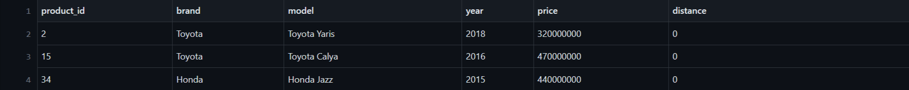

## Analytical Query

### 1. Car model popularity ranking based on bid amount

Query:

```sql
SELECT
  model, 
  COUNT(product_id) AS count_product,
  COUNT(bid_id) AS count_bid
 FROM 
    ads
 INNER JOIN 
    products
    USING(product_id)
 LEFT JOIN
  bids
  USING(ad_id)
 GROUP BY 
  model
 ORDER BY
  count_bid DESC
```

Output:
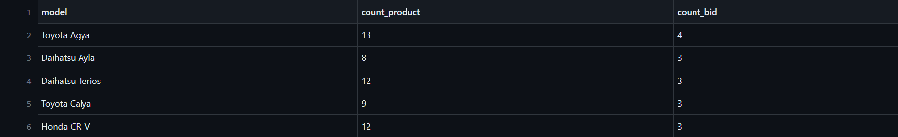

### 2. Compare car prices based on the average price per city

Query:

```sql
SELECT
  name AS nama_kota,
  brand,
  model,
  year,
  price,
  AVG(price) OVER(PARTITION BY name) AS avg_car_city
 FROM 
    city
 INNER JOIN
  seller_address
  USING(city_id)
 INNER JOIN
  ads
  USING(seller_id)
 LEFT JOIN
  products
  USING(product_id)
 ORDER BY
    6 ASC, 
    5 ASC
```

Output:
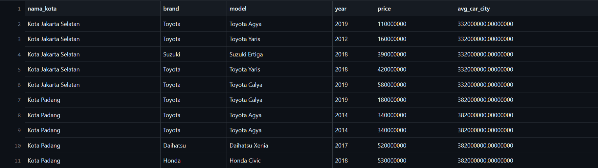

### 3. From the car model's offers, compare the date the user made a bid with the date of the next bid and the respective bid prices

Query:

```sql
SELECT 
    model,
    buyer_id,
    FIRST_VALUE(bids.created_at) OVER(PARTITION BY buyer_id) AS first_bid_date,
    LEAD(bids.created_at) OVER(PARTITION BY buyer_id) AS next_bid_date,
    FIRST_VALUE(amount) OVER(PARTITION BY buyer_id) AS first_bid_price,
    LEAD(amount) OVER(PARTITION BY buyer_id) AS next_bid_price
FROM 
    bids
INNER JOIN
    ads
    USING(ad_id)
LEFT JOIN
    products
    USING(product_id)
WHERE
    model = 'Toyota Yaris'
ORDER BY
    3 ASC
```

Output:
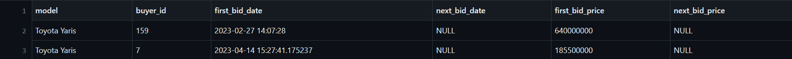

### 4. Comparing the percentage difference between the average car price by model and the average bid price offered by customers in the last 6 months

Query:

```sql
SELECT
    model,
    AVG(price) AS avg_price,
    AVG(amount) AS avg_bid_6month,
    AVG(price) - AVG(amount) AS difference,
    ((AVG(price) - AVG(amount)) / AVG(price))::float * 100 AS difference_percent
FROM
    bids
INNER JOIN
    ads
    USING(ad_id)
LEFT JOIN
    products
    USING(product_id)
WHERE
    bids.created_at >= CURRENT_TIMESTAMP - INTERVAL '6 months'
GROUP BY
    model
```

Output:
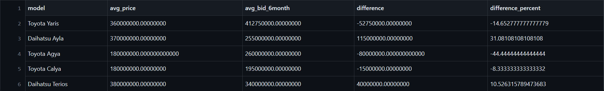

### 5. Create a window function for the average bid price of a car brand and model for the last 6 months

Query:

```sql
WITH bids_yaris AS (
    SELECT
        brand,
        model,
        bids.created_at,
        amount
    FROM
        bids
    INNER JOIN
        ads
        USING(ad_id)
    LEFT JOIN
        products
        USING(product_id)
    WHERE
        model = 'Toyota Yaris'
 )
 SELECT
  DISTINCT brand,
  model,
  (SELECT AVG(amount) FROM bids_yaris WHERE created_at >= CURRENT_TIMESTAMP - interval '6 months') AS m_min_6,
  (SELECT AVG(amount) FROM bids_yaris WHERE created_at >= CURRENT_TIMESTAMP - interval '5 months') AS m_min_5,
  (SELECT AVG(amount) FROM bids_yaris WHERE created_at >= CURRENT_TIMESTAMP - interval '4 months') AS m_min_4,
  (SELECT AVG(amount) FROM bids_yaris WHERE created_at >= CURRENT_TIMESTAMP - interval '3 months') AS m_min_3,
  (SELECT AVG(amount) FROM bids_yaris WHERE created_at >= CURRENT_TIMESTAMP - interval '2 months') AS m_min_2,
  (SELECT AVG(amount) FROM bids_yaris WHERE created_at >= CURRENT_TIMESTAMP - interval '1 months') AS m_min_1
 FROM
  bids_yaris
```

Output:


## Conclusion

That concludes the overview of the process for designing PostgreSQL database. Additionally, it is important to implement a backup and restore mechanism to ensure data integrity in case of any issues or data loss.
